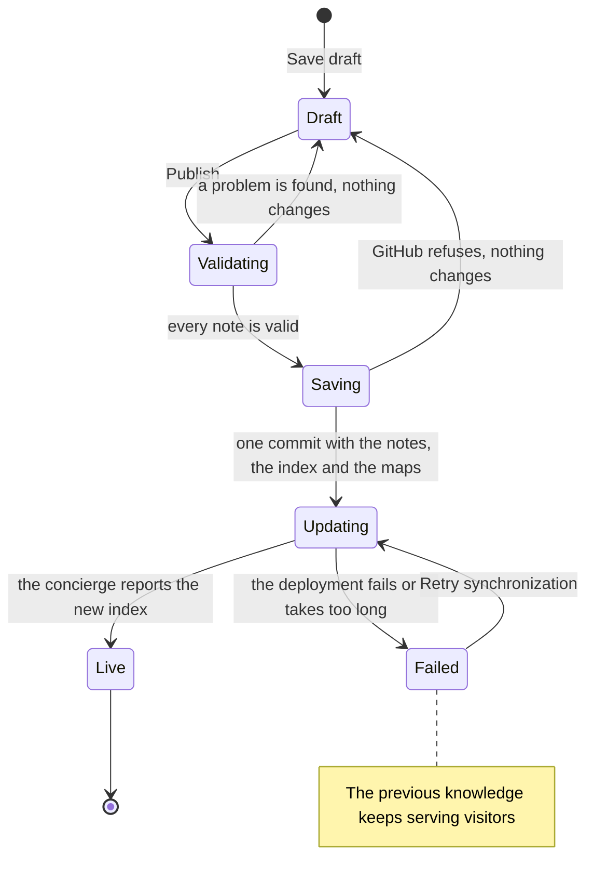
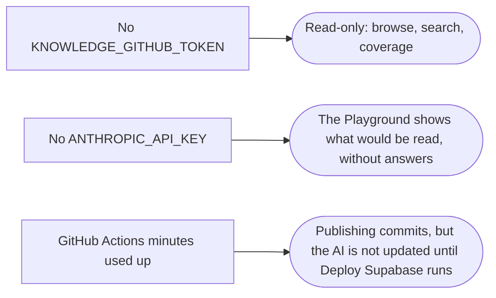

# Publishing flow

What "Publish" does in Knowledge Studio (docs/knowledge-studio.md, section 5).

```mermaid
stateDiagram-v2
  [*] --> Draft: Save draft
  Draft --> Validating: Publish
  Validating --> Draft: a problem is found, nothing changes
  Validating --> Saving: every note is valid
  Saving --> Draft: GitHub refuses, nothing changes
  Saving --> Updating: one commit with the notes, the index and the maps
  Updating --> Live: the concierge reports the new index
  Updating --> Failed: the deployment fails or takes too long
  Failed --> Updating: Retry synchronization
  Live --> [*]
  note right of Failed
    The previous knowledge keeps serving visitors
  end note
```

## While nothing is set up

```mermaid
flowchart LR
  A["No KNOWLEDGE_GITHUB_TOKEN"] --> R(["Read-only: browse, search, coverage"])
  B["No ANTHROPIC_API_KEY"] --> P(["The Playground shows what would be read, without answers"])
  C["GitHub Actions minutes used up"] --> D(["Publishing commits, but the AI is not updated until Deploy Supabase runs"])
```
See also [[Knowledge architecture]] and [[Brain roadmap]].
